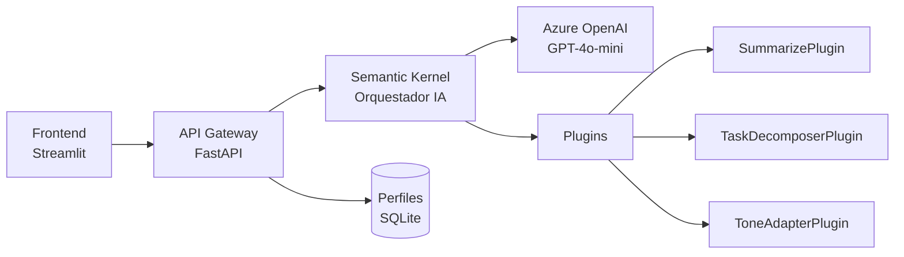

[English](README.md) | Español

## ♿ AccesAI — Asistente de texto accesible para neurodivergencias

> *Hackathon Innovation Challenge 2026*

AccesAI es una plataforma que transforma textos densos en contenido claro, estructurado y adaptado a perfiles de accesibilidad como **TDAH**, **autismo** o **fatiga cognitiva**, utilizando IA generativa (GPT‑4) y un backend modular en Python.

---

## 🧠 El problema

Las personas con condiciones neurodivergentes (TDAH, autismo, dislexia, etc.) a menudo enfrentan barreras al leer textos largos, complejos o mal estructurados. La información académica, legal o técnica puede resultar abrumadora, generando ansiedad y deserción.

**¿Cómo podemos hacer que el texto sea más accesible sin perder el significado original?**

---

## ✨ Nuestra solución

AccesAI ofrece una **API REST** que recibe un texto y un perfil de accesibilidad, y devuelve:

- ✅ Texto simplificado  
- 📋 Pasos desglosados (para tareas complejas)  
- 🎯 Tono calmado y adaptado  
- 💡 Explicación de las transformaciones aplicadas  

El sistema está diseñado para integrarse en aplicaciones educativas, portales de trabajo o herramientas de productividad, permitiendo que cada usuario elija cómo quiere consumir la información.

---

## 🏗️ Arquitectura

# FALTA TERMINAR EL README