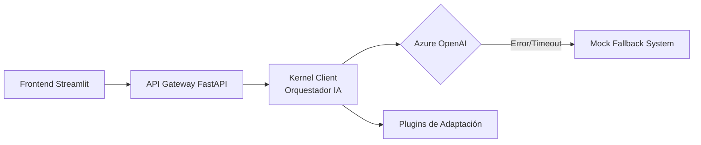

[English](README.md) | Español

# 🧠 AccesAI — Asistente de Accesibilidad Cognitiva

> _Proyecto destacado - Hackathon Innovation Challenge 2026_

AccesAI es una solución avanzada diseñada para reducir la carga cognitiva de textos complejos, adaptándolos automáticamente a perfiles de neurodiversidad como TDAH (ADHD) y Autismo. Utiliza IA Generativa, Microsoft Semantic Kernel y una arquitectura de software robusta para garantizar la inclusión digital.

## 🚀 Propósito y Visión

Nuestra misión es eliminar las barreras de comprensión en información técnica y administrativa. Mediante la simplificación estructural, lingüística y visual, permitimos que cualquier usuario acceda al conocimiento sin importar sus necesidades de procesamiento cognitivo.

## 🛠️ Stack Tecnológico

| Área               | Tecnologías                                      |
| ------------------ | ------------------------------------------------ |
| Backend            | Python 3.12+, FastAPI, Uvicorn                   |
| IA & Orquestación  | Microsoft Semantic Kernel, Azure OpenAI (GPT-4o) |
| Frontend           | Streamlit (Interfaz accesible en src/ui)         |
| Gestor de Paquetes | uv (Fast Python package installer)               |
| Arquitectura       | Clean Architecture con Graceful Degradation      |

## 🏗️ Arquitectura del Sistema



### Características de Ingeniería Senior

- Graceful Degradation: Implementación de un sistema de fallback automático. Si el servicio de Azure OpenAI falla o presenta latencia crítica, el sistema activa un motor determinista para asegurar la continuidad del servicio.

- Procesamiento Asíncrono: Flujo de datos no bloqueante (async/await) para optimizar recursos y mejorar la experiencia de usuario.

## 📂 Estructura del Proyecto

```bash
Hackathon-Innovation-Challenge-2026
├─ src/
│  ├─ api/          # Endpoints de FastAPI (routes.py)
│  ├─ core/         # Lógica central e IA (kernel_client.py)
│  ├─ models/       # Esquemas de Pydantic (schemas.py)
│  ├─ ui/           # Interfaz de usuario (app.py)
│  └─ main.py       # Punto de entrada de la API
├─ test/            # Suite de pruebas (test_kernel.py)
├─ pyproject.toml   # Configuración de dependencias (uv)
└─ README.md
```

## 🚦 Instalación y Ejecución

1. **Preparar el Envorn (con uv)**

   Sincronizar dependencias y crear entorno virtual

   ```bash
   uv sync
   source .venv/bin/activate  # En Windows: .venv\Scripts\activate
   ```

2. **Validación (Testing)**

   Verifica que el motor de IA y el sistema de respaldo (Mock) responden correctamente antes del despliegue:

   ```bash
   python -m test.test_kernel
   ```

3. **Lanzamiento del Sistema**

   **Backend (API):**

   ```bash
   uvicorn src.main:app --reload
   ```

   **Frontend (UI):**

   Ejecutar desde la raíz del proyecto

   ```bash
   streamlit run src/ui/app.py
   ```

👥 Equipo de Desarrollo

| Rol                                   | Responsable                  |
| ------------------------------------- | ---------------------------- |
| Lead Engineer (Arch, Backend, FE, IA) | Jorge de la Flor (FrostCore) |
| AI Specialist / Concepto FastAPI      | Lidya Marín                  |

Hecho con ❤️ por el Equipo 7 para hacer la información más accesible para todos.
