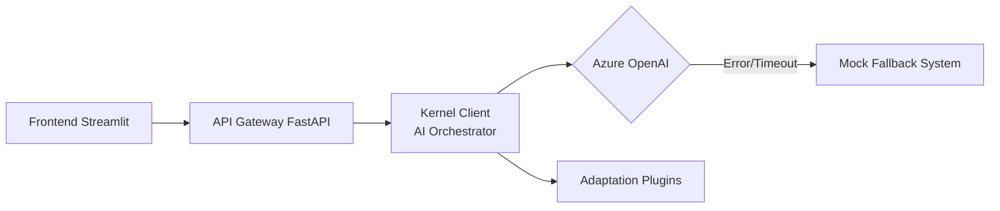

English | [Español](README.es.md)

# 🧠 AccesAI — Cognitive Accessibility Assistant

> _Featured Project - Hackathon Innovation Challenge 2026_

AccesAI is an advanced solution designed to reduce the cognitive load of complex texts by automatically adapting them to neurodiversity profiles such as ADHD and Autism. It uses Generative AI, the Microsoft Semantic Kernel, and a robust software architecture to ensure digital inclusion.

## 🚀 Purpose and Vision

Our mission is to eliminate barriers to understanding technical and administrative information. Through structural, linguistic, and visual simplification, we enable any user to access knowledge regardless of their cognitive processing needs.

## 🛠️ Technology Stack

| Area               | Technologies                                     |
| ------------------ | ------------------------------------------------ |
| Backend            | Python 3.12+, FastAPI, Uvicorn                   |
| AI & Orchestration | Microsoft Semantic Kernel, Azure OpenAI (GPT-4o) |
| Frontend           | Streamlit (Accessible interface in src/ui)       |
| Package Manager    | uv (Fast Python package installer)               |
| Architecture       | Clean Architecture with Graceful Degradation     |

## 🏗️ System Architecture



### Senior Engineering Features

- Graceful Degradation: Implementation of an automatic fallback system. If the Azure OpenAI service fails or experiences critical latency, the system activates a deterministic engine to ensure service continuity.

- Asynchronous Processing: Non-blocking data flow (async/await) to optimize resources and improve user experience.

## 📂 Project Structure

```bash
Hackathon-Innovation-Challenge-2026
├─ src/
│ ├─ api/           # FastAPI Endpoints (routes.py)
│ ├─ core/          # Core Logic and AI (kernel_client.py)
│ ├─ models/        # Pydantic Schemas (schemas.py)
│ ├─ ui/            # User Interface (app.py)
│ └─ main.py        # API Entry Point
├─ test/            # Test Suite (test_kernel.py)
├─ pyproject.toml   # Dependency Configuration (uv)
└─ README.md
```

## 🚦 Installation and Execution

1. **Prepare the Environment (with uv)**

   Sync dependencies and create a virtual environment

   ```bash
   uv sync
   source .venv/bin/activate # On Windows: .venv\Scripts\activate
   ```

2. **Validation (Testing)**

   Verify that the AI ​​engine and the mock system are responding correctly before deployment:

   ```bash
   python -m test.test_kernel
   ```

3. **System Launch**

   **Backend (API):**

   ```bash
   uvicorn src.main:app --reload
   ```

   **Frontend (UI):**

   Run from the project root

   ```bash
   streamlit run src/ui/app.py
   ```

👥 Development Team

| Role                                  | Responsible                  |
| ------------------------------------- | ---------------------------- |
| Lead Engineer (Arch, Backend, FE, AI) | Jorge de la Flor (FrostCore) |
| AI Specialist / FastAPI Concept       | Lidya Marín                  |

Made with ❤️ by Team 7 to make information more accessible to everyone.
